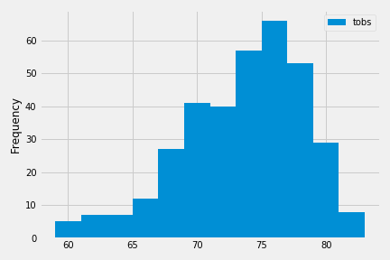

# Surfs Up!!!

The main objective of this assignment was to help with trip planning, we did some climate analysis on the given area, Honululu, Hawai. The following outlines what we did.

## Step 1 - Climate Analysis and Exploration

I used Python and SQLAlchemy to do basic climate analysis and data exploration of the climate database. All of the following analysis were completed using SQLAlchemy ORM queries, Pandas, and Matplotlib.

* Used [starter notebook](climate_starter.ipynb) and [hawaii.sqlite](Resources/hawaii.sqlite) files to complete climate analysis and data exploration.

* Randomly chose a start date and end date for trip where vacation range was approximately 3-15 days total.

* Used SQLAlchemy `create_engine` to connect with sqlite database.

* Used SQLAlchemy `automap_base()` to reflect tables into classes and saved a reference to those classes called `Station` and `Measurement`.

### Precipitation Analysis

* Designed a query to retrieve the last 12 months of precipitation data.

* Selected only the `date` and `prcp` values.

* Loaded the query results into a Pandas DataFrame and set the index to the date column.

* Sorted the DataFrame values by `date`.

* Plotted the results using the DataFrame `plot` method.

  

* Used Pandas to print the summary statistics for the precipitation data.

### Station Analysis

* Designed a query to calculate the total number of stations.

* Designed a query to find the most active stations.

  * Listed the stations and observation counts in descending order.

  * Recorded the station that has the highest number of observations.

  * Used functions such as `func.min`, `func.max`, `func.avg`, and `func.count` in  queries.

* Designed a query to retrieve the last 12 months of temperature observation data (tobs).

  * Filtered by the station with the highest number of observations.

  * Plotted the results as a histogram with `bins=12`.

    

- - -

## Step 2 - Climate App

Designed a Flask API based on the queries that we have just developed.

* Used FLASK to create your routes.

### Routes

* `/`

  * Home page.

  * List all routes that are available.

* `/api/v1.0/precipitation`

  * Convert the query results to a Dictionary using `date` as the key and `prcp` as the value.

  * Return the JSON representation of the dictionary.

* `/api/v1.0/stations`

  * Return a JSON list of stations from the dataset.

* `/api/v1.0/tobs`
  * query for the dates and temperature observations from a year from the last data point.
  * Return a JSON list of Temperature Observations (tobs) for the previous year.

* `/api/v1.0/<start>` and `/api/v1.0/<start>/<end>`

  * Return a JSON list of the minimum temperature, the average temperature, and the max temperature for a given start or start-end range.

  * When given the start only, calculate `TMIN`, `TAVG`, and `TMAX` for all dates greater than and equal to the start date.

  * When given the start and the end date, calculate the `TMIN`, `TAVG`, and `TMAX` for dates between the start and end date inclusive.

For this part of the project I used the station and measurement tables for some of the analysis queries. Alongwith I used Flask `jsonify` to convert API data into a valid JSON response object.

- - -

